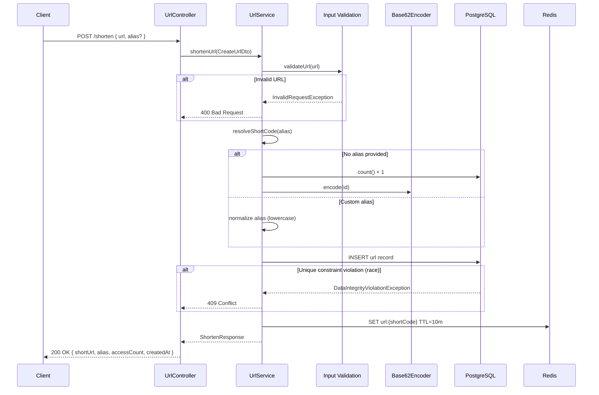
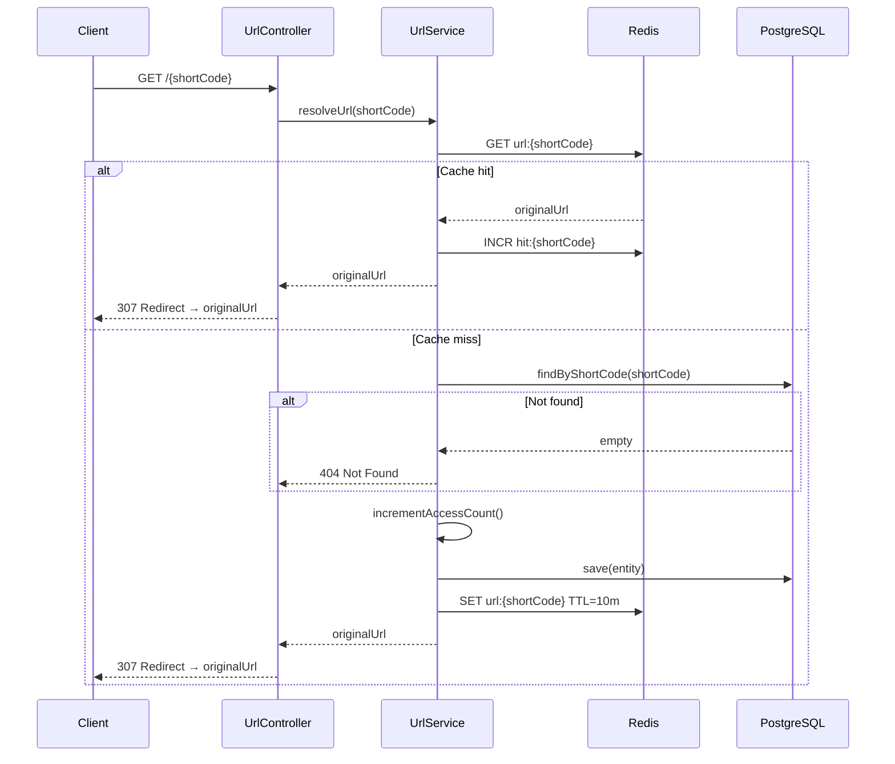
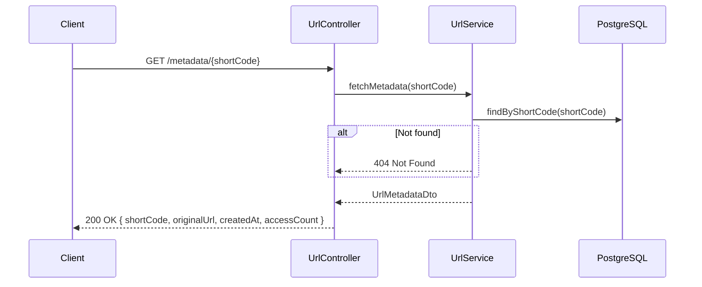
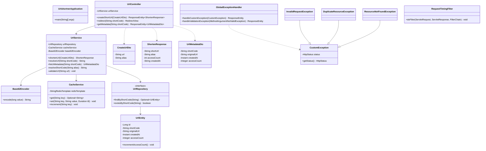

# URL Shortener — Design Document

## 1. Summary

Build a **production-ready REST API service** that accepts a long URL, generates a shortened URL (alias), redirects users to the original URL, and handles concurrent creation requests safely.

The service is implemented as a **Spring Boot 3** application with a layered architecture:

- **Controller layer** — exposes HTTP endpoints for creation, redirection, and metadata.
- **Service layer** — validates input, generates or accepts short codes, orchestrates caching, and updates access counts.
- **Repository layer** — persists URL records in a relational database (PostgreSQL in production, H2 for local/test fallback).
- **Cache layer** — uses Redis for fast redirect lookups on heavily accessed links.

Core capabilities:

| Capability | Description |
|------------|-------------|
| **Creation** | Accept a long URL and generate a unique shortened URL. |
| **Customization & collision handling** | Support optional custom aliases; detect duplicates and race conditions via DB unique constraints. |
| **Redirection** | Redirect users to the original URL when the short link is accessed, with Redis cache-aside for hot paths. |
| **Metadata** | Return creation time and access counts for a shortened URL. |

---

## 2. Functional Requirements

### 2.1 URL Creation

| ID | Requirement |
|----|-------------|
| FR-01 | The system **shall** accept a POST request with a long URL and create a corresponding short URL. |
| FR-02 | The system **shall** auto-generate a unique short code when no custom alias is provided. |
| FR-03 | The system **shall** return the full short URL, short code, initial access count (0), and creation timestamp in the response. |
| FR-04 | The system **shall** validate that the input URL is well-formed (valid scheme and host) before persisting. |

### 2.2 Custom Aliases & Collision Handling

| ID | Requirement |
|----|-------------|
| FR-05 | The system **shall** allow an optional custom alias (3–30 lowercase alphanumeric characters or dashes). |
| FR-06 | The system **shall** reject duplicate aliases with HTTP **409 Conflict**. |
| FR-07 | The system **shall** handle concurrent requests for the same alias safely using a **database unique constraint** on `short_code`; only one insert succeeds, others receive 409. |
| FR-08 | Custom aliases **shall** be normalized to lowercase before storage. |

### 2.3 Redirection

| ID | Requirement |
|----|-------------|
| FR-09 | The system **shall** redirect `GET /{shortCode}` to the original long URL using HTTP **307 Temporary Redirect**. |
| FR-10 | The system **shall** return HTTP **404 Not Found** when the short code does not exist. |
| FR-11 | The system **shall** check Redis first on redirect; on cache miss, load from the database and repopulate the cache. |
| FR-12 | The system **shall** increment the access count when a redirect is resolved (database on cache miss; Redis hit counter on cache hit). |

### 2.4 Metadata

| ID | Requirement |
|----|-------------|
| FR-13 | The system **shall** expose `GET /metadata/{shortCode}` returning short code, original URL, creation time, and access count. |
| FR-14 | The system **shall** return HTTP **404 Not Found** when metadata is requested for a non-existent short code. |

### 2.5 Caching

| ID | Requirement |
|----|-------------|
| FR-15 | The system **shall** write new URL mappings to Redis on creation with a configurable TTL (default: 10 minutes). |
| FR-16 | The system **shall** degrade gracefully when Redis is unavailable (fall back to database without failing the request). |

---

## 3. Non-Functional Requirements

### 3.1 Performance & Scalability

| ID | Requirement |
|----|-------------|
| NFR-01 | Redirect lookups **shall** target sub-10 ms latency for cache hits under normal load. |
| NFR-02 | The cache layer **shall** reduce database read load for frequently accessed short codes. |
| NFR-03 | The service **shall** support horizontal scaling (stateless application instances sharing PostgreSQL and Redis). |

### 3.2 Reliability & Concurrency

| ID | Requirement |
|----|-------------|
| NFR-04 | Short code uniqueness **shall** be enforced at the database level, not only in application logic. |
| NFR-05 | Concurrent alias creation **shall** not corrupt data; failed races **shall** return a clear conflict response. |
| NFR-06 | Redis failures **shall not** cause redirect or creation requests to fail. |

### 3.3 Security

| ID | Requirement |
|----|-------------|
| NFR-07 | Input validation **shall** reject malformed URLs before persistence. |
| NFR-08 | Alias format **shall** be restricted to prevent path injection and reserved-route conflicts. |

### 3.4 Observability & Maintainability

| ID | Requirement |
|----|-------------|
| NFR-09 | Request timing **shall** be logged per HTTP request (method, URI, duration). |
| NFR-10 | The codebase **shall** follow a layered architecture (controller → service → repository/cache). |
| NFR-11 | Error responses **shall** use consistent JSON bodies with appropriate HTTP status codes. |

### 3.5 DevOps

| ID | Requirement |
|----|-------------|
| NFR-12 | The project **shall** include a CI pipeline that builds and runs tests on every push/PR. |
| NFR-13 | Setup and execution **shall** be documented in the README. |
| NFR-14 | Local development **shall** work without PostgreSQL/Redis via H2 in-memory and silent cache fallback. |

---

## 4. Architecture

### 4.1 Component Overview

```
┌─────────────┐     ┌──────────────────┐     ┌─────────────┐
│   Client    │────▶│  UrlController   │────▶│  UrlService │
└─────────────┘     └──────────────────┘     └──────┬──────┘
                                                     │
                              ┌──────────────────────┼──────────────────────┐
                              ▼                      ▼                      ▼
                       ┌─────────────┐       ┌─────────────┐       ┌──────────────┐
                       │ UrlRepository│       │ CacheService│       │ Base62Encoder│
                       └──────┬──────┘       └──────┬──────┘       └──────────────┘
                              │                     │
                              ▼                     ▼
                       ┌─────────────┐       ┌─────────────┐
                       │ PostgreSQL  │       │    Redis    │
                       │   (or H2)   │       │             │
                       └─────────────┘       └─────────────┘
```

### 4.2 Request Lifecycle — Create Short URL



### 4.3 Request Lifecycle — Redirect



### 4.4 Request Lifecycle — Metadata



---

## 5. API Specification

### 5.1 Endpoints

| Method | Path | Description | Success | Error codes |
|--------|------|-------------|---------|-------------|
| `POST` | `/shorten` | Create a short URL | `200 OK` | `400`, `409` |
| `GET` | `/{shortCode}` | Redirect to original URL | `307 Redirect` | `404` |
| `GET` | `/metadata/{shortCode}` | Get URL metadata | `200 OK` | `404` |

### 5.2 Request / Response Examples

**Create short URL**

```http
POST /shorten
Content-Type: application/json

{
  "url": "https://example.com/long/path",
  "alias": "my-link"
}
```

```json
{
  "shortUrl": "http://localhost:8080/my-link",
  "alias": "my-link",
  "accessCount": 0,
  "createdAt": "2026-06-27T10:00:00Z"
}
```

**Metadata**

```json
{
  "shortCode": "my-link",
  "originalUrl": "https://example.com/long/path",
  "createdAt": "2026-06-27T10:00:00Z",
  "accessCount": 42
}
```

**Validation error**

```json
{
  "message": "Validation failed",
  "errors": {
    "url": "URL is required",
    "alias": "Alias must be 3-30 lowercase letters, numbers, or dashes"
  }
}
```

**Business error**

```json
{
  "message": "Short code already exists"
}
```

---

## 6. Database Schema

### 6.1 Entity-Relationship

The service uses a single table, `urls`, mapped by the JPA entity `UrlEntity`.

### 6.2 Table: `urls`

| Column | SQL Type | Constraints | Description |
|--------|----------|-------------|-------------|
| `id` | `BIGSERIAL` | `PRIMARY KEY` | Surrogate key (auto-generated) |
| `short_code` | `VARCHAR(64)` | `NOT NULL`, `UNIQUE` | Short code or custom alias used in URLs |
| `original_url` | `VARCHAR(2048)` | `NOT NULL` | Original long URL |
| `created_at` | `TIMESTAMP` | `NOT NULL` | UTC creation timestamp |
| `access_count` | `INTEGER` | `NOT NULL`, default `0` | Number of successful redirects (DB-tracked) |

### 6.3 DDL (PostgreSQL)

```sql
CREATE TABLE urls (
    id           BIGSERIAL PRIMARY KEY,
    short_code   VARCHAR(64)  NOT NULL UNIQUE,
    original_url VARCHAR(2048) NOT NULL,
    created_at   TIMESTAMP    NOT NULL,
    access_count INTEGER      NOT NULL DEFAULT 0
);

CREATE UNIQUE INDEX idx_urls_short_code ON urls (short_code);
```

### 6.4 Concurrency Guarantee

The `UNIQUE` constraint on `short_code` is the **authoritative** guard against duplicate aliases under concurrent writes. The application catches `DataIntegrityViolationException` and maps it to HTTP 409.

---

## 7. Redis Cache Schema

| Key pattern | Value | TTL | Purpose |
|-------------|-------|-----|---------|
| `url:{shortCode}` | Original URL string | 10 minutes | Fast redirect lookup |
| `hit:{shortCode}` | Integer counter | None | Cache-hit metric (operational) |

**Cache-aside flow:**

1. **Write on create** — after DB insert, populate `url:{shortCode}`.
2. **Read on redirect** — check Redis first; on miss, read DB, update access count, repopulate cache.
3. **Graceful degradation** — if Redis is down, all operations fall back to the database.

---

## 8. Class Diagram



### 8.1 Package Structure

```
com.aman.urlshortner
├── UrlshortnerApplication.java      # Spring Boot entry point
├── controller/
│   └── UrlController.java           # REST endpoints
├── service/
│   ├── UrlService.java              # Business logic
│   └── Base62Encoder.java           # Auto-generated code encoding
├── repository/
│   └── UrlRepository.java           # JPA data access
├── entity/
│   └── UrlEntity.java               # JPA entity / DB mapping
├── dto/
│   ├── CreateUrlDto.java            # Create request
│   ├── ShortenResponse.java         # Create response
│   └── UrlMetadataDto.java          # Metadata response
├── cache/
│   └── CacheService.java            # Redis wrapper
├── exception/
│   ├── CustomException.java
│   ├── InvalidRequestException.java
│   ├── DuplicateResourceException.java
│   ├── ResourceNotFoundException.java
│   └── GlobalExceptionHandler.java
└── filter/
    └── RequestTimingFilter.java     # Request duration logging
```

---

## 9. Validation & Error Handling

### 9.1 Input Validation

| Field | Rule | HTTP status | Handler |
|-------|------|-------------|---------|
| `url` | Required (`@NotBlank`) | 400 | `MethodArgumentNotValidException` |
| `url` | Valid URI with scheme and host | 400 | `InvalidRequestException` |
| `alias` | Optional; if present: `^[a-z0-9-]{3,30}$` | 400 | `MethodArgumentNotValidException` |

### 9.2 Failure Handling Matrix

| Scenario | HTTP Status | Exception | Response body |
|----------|-------------|-----------|---------------|
| Missing or blank URL | 400 | `MethodArgumentNotValidException` | `{ "message": "Validation failed", "errors": { ... } }` |
| Invalid alias format | 400 | `MethodArgumentNotValidException` | `{ "message": "Validation failed", "errors": { ... } }` |
| Malformed URL (no scheme/host) | 400 | `InvalidRequestException` | `{ "message": "Invalid URL" }` |
| Duplicate alias / short code | 409 | `DuplicateResourceException` | `{ "message": "Short code already exists" }` |
| Short code not found (redirect) | 404 | `ResourceNotFoundException` | `{ "message": "Short code not found" }` |
| Short code not found (metadata) | 404 | `ResourceNotFoundException` | `{ "message": "Short code not found" }` |
| Redis unavailable | 200 / 307 | *(none — graceful fallback)* | Normal success response via DB |
| Database unavailable | 500 | Spring default | Standard server error |

### 9.3 Concurrency & Thread Safety

| Concern | Strategy |
|---------|----------|
| Duplicate custom alias (simultaneous requests) | PostgreSQL `UNIQUE` on `short_code`; app catches violation → 409 |
| Auto-generated code collision | Base62 encoding of sequential ID; uniqueness enforced by DB constraint on retry |
| Access count updates | Increment on DB entity during cache-miss redirects; Redis `INCR` for cache-hit tracking |
| Cache consistency | Cache-aside with TTL; stale cache expires automatically |

---

## 10. Testing Strategy

### 10.1 Unit Tests

| Test class | Scope | Coverage |
|------------|-------|----------|
| `UrlServiceTest` | Service layer (mocked dependencies) | Duplicate alias → `DuplicateResourceException` on DB constraint violation |

**Recommended additions:** `Base62Encoder` encoding edge cases, URL validation, cache hit/miss behavior.

### 10.2 Integration Tests

| Test class | Scope | Coverage |
|------------|-------|----------|
| `UrlShortenerControllerTest` | Full Spring context + MockMvc | Create + redirect happy path, duplicate alias (409), invalid URL (400) |
| `UrlshortnerApplicationTests` | Context load | Application starts successfully |

**Recommended additions:** Metadata endpoint, auto-generated codes (no alias), 404 on unknown short code.

### 10.3 Running Tests

```bash
./mvnw test
```

Tests use **H2 in-memory** database by default. Redis failures are swallowed by `CacheService`, so tests pass without a running Redis instance.

---

## 11. CI/CD

### 11.1 Pipeline

File: [`.github/workflows/ci.yml`](.github/workflows/ci.yml)

| Trigger | Branches |
|---------|----------|
| Push | `main`, `master` |
| Pull request | `main`, `master` |

| Step | Action |
|------|--------|
| Checkout | `actions/checkout@v4` |
| Setup JDK | Temurin **21** with Maven cache |
| Build & test | `./mvnw -q test` |

### 11.2 Future CI Enhancements

- Add Redis and PostgreSQL service containers for integration tests.
- Add code coverage reporting.
- Add Docker image build and push on release tags.

---

## 12. Setup Instructions

### 12.1 Prerequisites

| Tool | Version | Required for |
|------|---------|--------------|
| Java | 21 (CI) / 17+ (pom) | Runtime & build |
| Maven | Wrapper included (`./mvnw`) | Build |
| PostgreSQL | 14+ | Production-like local run |
| Redis | 6+ | Caching (optional for basic local run) |

### 12.2 Quick Start (H2 + optional Redis)

The application starts with **zero external dependencies** using H2 in-memory defaults:

```bash
git clone <repository-url>
cd urlshortner
./mvnw spring-boot:run
```

The API is available at `http://localhost:8080`.

### 12.3 Production-Like Local Setup (PostgreSQL + Redis)

**Step 1 — Start PostgreSQL**

```bash
# Example using Docker
docker run -d --name urlshortener-pg \
  -e POSTGRES_DB=urlshortener \
  -e POSTGRES_USER=postgres \
  -e POSTGRES_PASSWORD=postgres \
  -p 5432:5432 \
  postgres:16
```

**Step 2 — Start Redis**

```bash
docker run -d --name urlshortener-redis \
  -p 6379:6379 \
  redis:7
```

**Step 3 — Configure environment variables**

```bash
export DB_URL=jdbc:postgresql://localhost:5432/urlshortener
export DB_USERNAME=postgres
export DB_PASSWORD=postgres
export DB_DRIVER_CLASS_NAME=org.postgresql.Driver
export HIBERNATE_DIALECT=org.hibernate.dialect.PostgreSQLDialect
export REDIS_HOST=localhost
export REDIS_PORT=6379
export SERVER_PORT=8080
```

**Step 4 — Run the application**

```bash
./mvnw spring-boot:run
```

### 12.4 Verify the Service

```bash
# Create a short URL
curl -X POST http://localhost:8080/shorten \
  -H "Content-Type: application/json" \
  -d '{"url":"https://example.com","alias":"demo"}'

# Redirect (follow headers only)
curl -I http://localhost:8080/demo

# Fetch metadata
curl http://localhost:8080/metadata/demo

# Run tests
./mvnw test
```

### 12.5 Configuration Reference

| Environment variable | Default | Description |
|---------------------|---------|-------------|
| `DB_URL` | H2 in-memory | JDBC connection URL |
| `DB_USERNAME` | `sa` | Database username |
| `DB_PASSWORD` | *(empty)* | Database password |
| `DB_DRIVER_CLASS_NAME` | `org.h2.Driver` | JDBC driver class |
| `HIBERNATE_DIALECT` | `H2Dialect` | Hibernate dialect |
| `REDIS_HOST` | `localhost` | Redis hostname |
| `REDIS_PORT` | `6379` | Redis port |
| `SERVER_PORT` | `8080` | HTTP server port |

Configuration files:

- [`src/main/resources/application.yml`](src/main/resources/application.yml)
- [`src/main/resources/application.properties`](src/main/resources/application.properties)

---

## 13. Technology Stack

| Layer | Technology |
|-------|------------|
| Framework | Spring Boot 3.5 |
| Web | Spring Web (REST) |
| Persistence | Spring Data JPA + Hibernate |
| Database | PostgreSQL (prod), H2 (dev/test) |
| Cache | Spring Data Redis |
| Validation | Jakarta Bean Validation |
| Build | Maven |
| Testing | JUnit 5, MockMvc, Mockito |
| CI | GitHub Actions |

---

## 14. Known Limitations & Future Improvements

| Area | Current state | Recommended improvement |
|------|---------------|-------------------------|
| Base URL in responses | Hardcoded `http://localhost:8080` | Configurable `app.base-url` property |
| Auto-generated IDs | `count() + 1` + Base62 | DB sequence or Redis `INCR` for concurrency safety |
| Access count on cache hits | Redis `hit:*` counter only | Sync DB count or expose combined metric |
| URL security | Scheme/host check only | Restrict to `http`/`https`; block private IPs |
| Schema migrations | `ddl-auto: update` | Flyway/Liquibase for production |
| Rate limiting | Not implemented | API gateway or Bucket4j |
| Authentication | Not implemented | API keys or OAuth for production |
| Observability | Request timing logs | Spring Actuator + Micrometer metrics |

---

## 15. References

- [README.md](README.md) — setup, API examples, and testing commands
- [DESIGN.md](DESIGN.md) — original design notes
- [`.github/workflows/ci.yml`](.github/workflows/ci.yml) — CI pipeline definition
